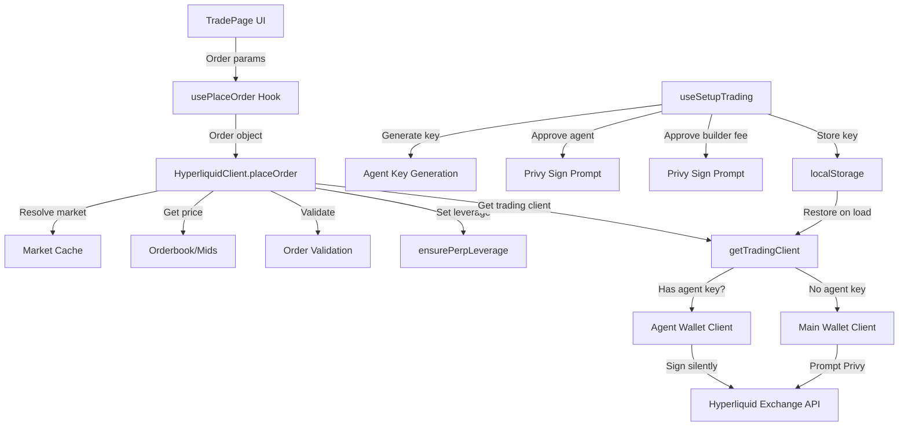

# Trading Functionality Analysis & Implementation Plan

## Executive Summary

**Status: ✅ Core functionality already implemented**

The trading functionality for market orders, limit orders, and leverage adjustment via agent wallet is already implemented in the codebase. This document outlines the current implementation and identifies any gaps or improvements needed.

---

## Current Implementation Status

### 1. Agent Wallet Setup ✅ IMPLEMENTED

**Files:**
- [`packages/hyperliquid-sdk/src/agent.ts`](packages/hyperliquid-sdk/src/agent.ts:1) - Agent key generation and storage
- [`packages/hyperliquid-sdk/src/hooks.ts:619-657`](packages/hyperliquid-sdk/src/hooks.ts:619) - `useSetupTrading()` hook
- [`apps/tg-mini-app/src/components/TradingSetupSheet.tsx`](apps/tg-mini-app/src/components/TradingSetupSheet.tsx:1) - UI for setup

**How it works:**
1. User clicks "Enable Trading" button
2. [`generateAgentKey()`](packages/hyperliquid-sdk/src/agent.ts:5) creates a new private key
3. [`client.approveAgent()`](packages/hyperliquid-sdk/src/client.ts:1153) prompts user to sign once via Privy
4. [`approveBuilderFee()`](packages/hyperliquid-sdk/src/builder.ts:54) prompts user to approve builder fee (if configured)
5. Agent key is stored in localStorage for future use
6. All subsequent trades sign silently using the agent key

**Flow:**
```
User → Enable Trading → Sign Agent Approval (1x) → Sign Builder Fee (1x) → Ready to Trade
```

### 2. Market Orders (Long/Short) ✅ IMPLEMENTED

**Files:**
- [`packages/hyperliquid-sdk/src/client.ts:894-934`](packages/hyperliquid-sdk/src/client.ts:894) - `placeOrder()` method
- [`packages/hyperliquid-sdk/src/client.ts:476-530`](packages/hyperliquid-sdk/src/client.ts:476) - `getMarketOrderExecutionContext()`
- [`apps/tg-mini-app/src/pages/TradePage.tsx:305-344`](apps/tg-mini-app/src/pages/TradePage.tsx:305) - UI handler

**How it works:**
1. User selects "Market" order type
2. Enters amount in USD
3. Selects leverage (1x, 2x, 3x, 5x, 10x, 20x, 25x, 50x)
4. Clicks "Long BTC" or "Short BTC"
5. [`placeOrder()`](packages/hyperliquid-sdk/src/client.ts:894) executes:
   - Resolves market metadata
   - Gets execution price from orderbook (best bid/ask) or mid price
   - Applies 5% slippage protection
   - Validates order (min size, balance)
   - Sets leverage via [`ensurePerpLeverage()`](packages/hyperliquid-sdk/src/client.ts:601)
   - Signs with agent wallet (silent)
   - Submits to Hyperliquid

**Order structure:**
```typescript
{
  coin: 'BTC',
  side: 'buy', // or 'sell'
  sizeUsd: 100,
  orderType: 'market',
  reduceOnly: false,
  leverage: 10,
  marketType: 'perp'
}
```

### 3. Limit Orders (Long/Short) ✅ IMPLEMENTED

**Files:**
- [`packages/hyperliquid-sdk/src/client.ts:894-934`](packages/hyperliquid-sdk/src/client.ts:894) - `placeOrder()` method
- [`apps/tg-mini-app/src/pages/TradePage.tsx:305-344`](apps/tg-mini-app/src/pages/TradePage.tsx:305) - UI handler

**How it works:**
1. User selects "Limit" order type
2. Enters amount in USD
3. Enters limit price
4. Selects TIF (Time in Force):
   - **Gtc** (Good till Cancel) - stays until filled or cancelled
   - **Ioc** (Immediate or Cancel) - fills immediately or cancels
   - **Alo** (Add Liquidity Only) - post-only, never crosses spread
5. Selects leverage
6. Clicks "Long BTC" or "Short BTC"
7. [`placeOrder()`](packages/hyperliquid-sdk/src/client.ts:894) executes with limit price

**Order structure:**
```typescript
{
  coin: 'BTC',
  side: 'buy',
  sizeUsd: 100,
  limitPx: 65000,
  orderType: 'limit',
  reduceOnly: false,
  leverage: 10,
  marketType: 'perp',
  tif: 'Gtc'
}
```

### 4. Leverage Adjustment ✅ IMPLEMENTED

**Files:**
- [`packages/hyperliquid-sdk/src/client.ts:1046-1058`](packages/hyperliquid-sdk/src/client.ts:1046) - `updateLeverage()` method
- [`packages/hyperliquid-sdk/src/client.ts:601-632`](packages/hyperliquid-sdk/src/client.ts:601) - `ensurePerpLeverage()` (auto-called)
- [`packages/hyperliquid-sdk/src/hooks.ts:334-348`](packages/hyperliquid-sdk/src/hooks.ts:334) - `useUpdateLeverage()` hook

**How it works:**
- Leverage is automatically set before each order via [`ensurePerpLeverage()`](packages/hyperliquid-sdk/src/client.ts:601)
- Detects existing position's leverage type (cross/isolated)
- Uses same leverage type as existing position (or defaults to cross)
- Falls back to opposite type if initial attempt fails
- Caches leverage type per market to avoid redundant calls

### 5. Order Validation ✅ IMPLEMENTED

**Files:**
- [`packages/hyperliquid-sdk/src/order-validation.ts`](packages/hyperliquid-sdk/src/order-validation.ts:1) - Validation logic
- [`apps/tg-mini-app/src/pages/TradePage.tsx:178-233`](apps/tg-mini-app/src/pages/TradePage.tsx:178) - UI validation

**Validations:**
- Minimum order size ($10 USD)
- Sufficient balance/margin
- Valid price for limit orders
- Market metadata available
- Reference price available

---

## Architecture Diagram



---

## Identified Gaps & Improvements

### Gap 1: No Dedicated Leverage Selection UI Component
**Current:** Leverage is selected via pills in TradePage
**Improvement:** Create a reusable `LeverageSelector` component with:
- Slider for fine-grained selection
- Quick select pills
- Max leverage display
- Current position leverage indicator

### Gap 2: No Order Confirmation Dialog
**Current:** Orders submit immediately on button click
**Improvement:** Add confirmation sheet showing:
- Order summary (side, size, leverage, estimated price)
- Liquidation price estimate
- Fee estimate
- Confirm/Cancel buttons

### Gap 3: No Position-Specific Leverage Display
**Current:** Leverage selector defaults to 1x or existing position leverage
**Improvement:** Show current position leverage prominently and warn when changing

### Gap 4: No Order History on TradePage
**Current:** Recent orders not visible on trade page
**Improvement:** Add collapsible "Recent Orders" section

### Gap 5: No Price Alerts for Limit Orders
**Current:** Limit orders placed silently
**Improvement:** Show notification when limit order fills

---

## Recommended Implementation Plan

### Phase 1: Verify Current Functionality (Quick Win)
**Goal:** Ensure all existing features work correctly

**Tasks:**
1. Test market order placement (long/short) on testnet
2. Test limit order placement (long/short) on testnet
3. Test leverage adjustment (cross/isolated)
4. Test agent wallet setup flow
5. Verify order validation edge cases

**Estimated effort:** 1-2 hours (testing only)

### Phase 2: UI/UX Improvements (Optional)
**Goal:** Enhance trading experience

**Tasks:**
1. Create `LeverageSelector` component
2. Add order confirmation sheet
3. Add liquidation price calculator
4. Add fee estimator
5. Improve error messages

**Estimated effort:** 4-6 hours

### Phase 3: Advanced Features (Future)
**Goal:** Add advanced trading features

**Tasks:**
1. TP/SL (Take Profit/Stop Loss) orders
2. Trailing stop orders
3. OCO (One-Cancels-Other) orders
4. Position sizing calculator
5. Risk/reward display

**Estimated effort:** 8-12 hours

---

## Key Code References

### Order Placement Flow
```typescript
// apps/tg-mini-app/src/pages/TradePage.tsx:322-331
const order: Order = {
  coin: symbol,
  side,
  sizeUsd: amountNum,
  orderType,
  reduceOnly: false,
  ...(isPerp && { leverage, marketType: 'perp' as const }),
  ...(!isPerp && { marketType: 'spot' as const }),
  ...(orderType === 'limit' && { limitPx: limitPriceNum, tif }),
};

const mutation = isPerp ? placeOrder : placeSpotOrder;
mutation.mutate(order, {
  onSuccess: () => { /* navigate back */ },
  onError: (error) => { /* show error */ },
});
```

### Agent Wallet Setup
```typescript
// packages/hyperliquid-sdk/src/hooks.ts:638-654
const setup = useMutation({
  mutationFn: async () => {
    const privateKey = generateAgentKey();
    const agentAddress = getAgentAddress(privateKey);
    await client.approveAgent(agentAddress); // Privy prompt (1x)
    if (isBuilderConfigured()) {
      await approveBuilderFeeAction(client); // Privy prompt (1x)
    }
    storeAgentKey(walletAddress, privateKey);
    client.setAgentKey(privateKey);
  },
});
```

### Leverage Management
```typescript
// packages/hyperliquid-sdk/src/client.ts:601-632
private async ensurePerpLeverage(market: CachedMarket, leverage?: number, reduceOnly?: boolean) {
  if (!leverage || leverage <= 0 || reduceOnly) return;
  
  const userState = await this.getUserState();
  const existingPosition = userState.assetPositions.find(...);
  const isCross = existingPosition?.leverage.type === 'cross' ?? true;
  
  // Skip if already at target leverage
  if (existingPosition?.leverage.value === leverage) return;
  
  await this.updateLeverage(market.name, leverage, isCross);
}
```

---

## Conclusion

The trading functionality you requested is **already implemented** in the codebase:

✅ **Market orders** (long/short) - Fully implemented with slippage protection
✅ **Limit orders** (long/short) - Fully implemented with TIF options
✅ **Leverage adjustment** - Automatically handled before each order
✅ **Agent wallet** - 1-click setup, silent signing for all trades

The implementation uses the `@nktkas/hyperliquid` SDK (v0.15.0) which is the most maintained TypeScript SDK for Hyperliquid, as recommended in the documentation.

**Next steps:**
1. Test the existing functionality on testnet
2. Optionally implement UI/UX improvements from Phase 2
3. Consider advanced features from Phase 3 for future iterations
